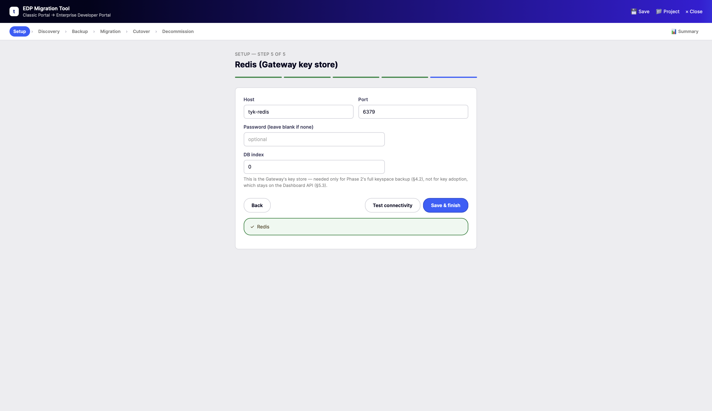
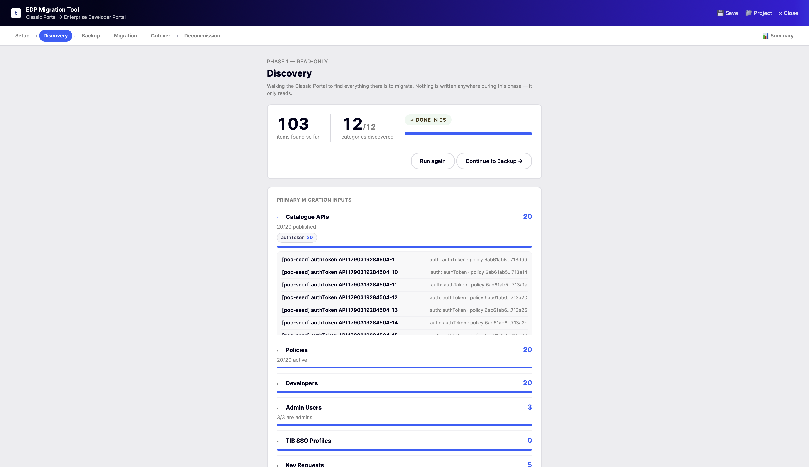
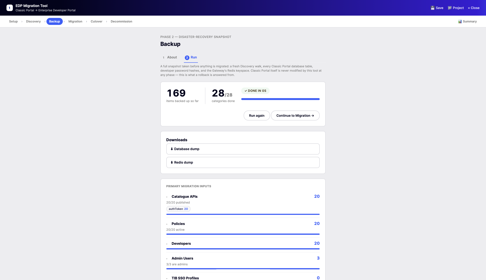
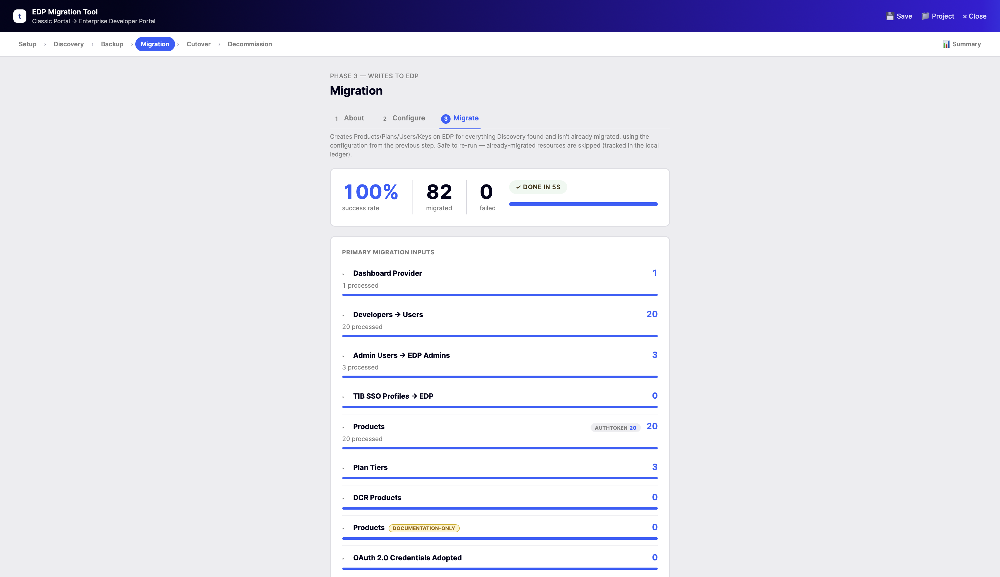
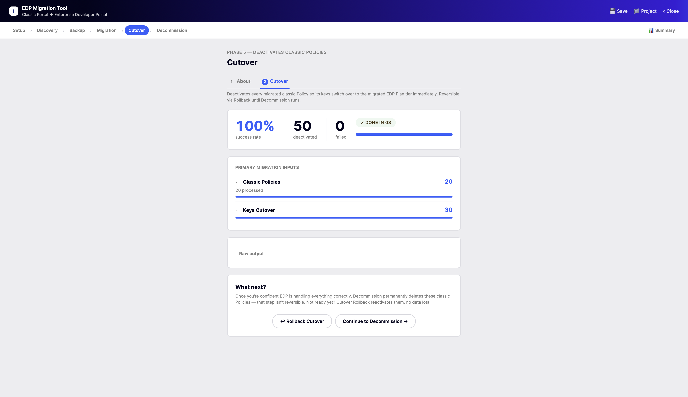
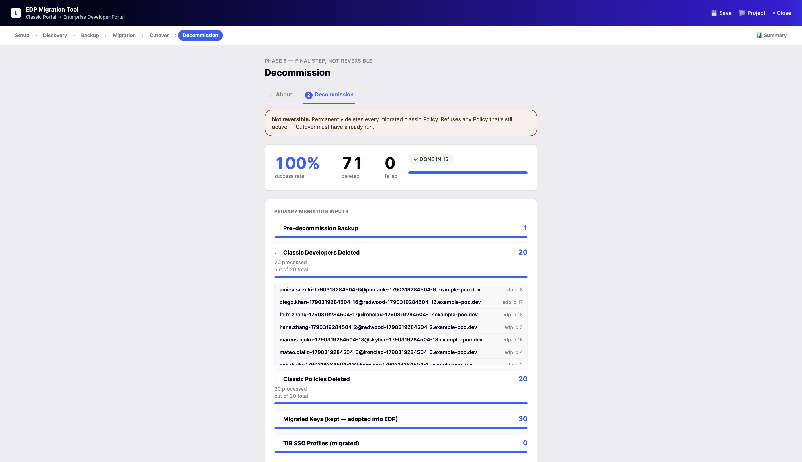
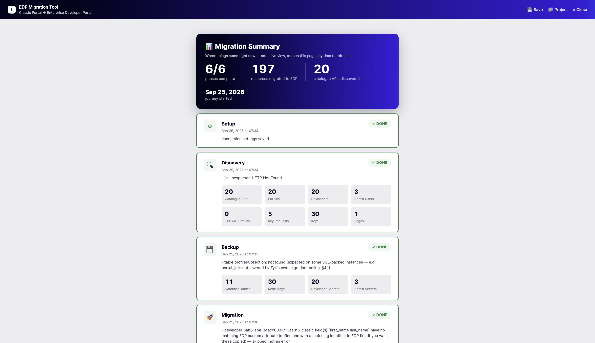

# EDP Migration POC

## Introduction

### The problem

Tyk's **Classic Developer Portal** lives inside the Tyk Dashboard itself —
developers, API catalogue entries, policies, issued keys, and pending key
requests are all Dashboard-native objects, managed through the Dashboard's
own `/api/portal/*` REST API. The **Enterprise Developer Portal (EDP)** is
a separate product entirely — its own container, its own database, its own
API — built around a different, richer data model: Products, Plans,
Providers, Applications, Access Requests. The two products don't share a
schema, and there is no built-in "Classic → EDP" migration path shipped
with either one.

That leaves anyone moving from Classic to EDP with a real, unavoidable
data-modeling problem: every developer, every published API, every access
policy, and every already-issued credential on the Classic side needs an
equivalent created on the EDP side — correctly enough that a developer's
existing key keeps working, and safely enough that nothing on the Classic
side gets torn down until the new setup is actually proven out.

### Migrating without a tool

Without something purpose-built for this, the only options are manual
recreation through the EDP admin UI/API, or a one-off script somebody
writes for a single migration and throws away afterward. Both share the
same problems in practice:

- **No re-run safety.** A script that isn't idempotent either duplicates
  everything on a second run, or has to be re-written to check "does this
  already exist?" before every single write — for every resource type.
- **No adopted credentials.** Recreating a developer's API key from
  scratch means it's a *new* key — every existing integration using the
  old one breaks the moment the Classic side is switched off, unless
  someone manually re-issues and redistributes credentials to every
  developer.
- **No safety net.** A hand-rolled migration has no equivalent of a
  pre-migration backup, no audit trail of what it actually created, and no
  clean way to undo itself if something turns out wrong halfway through.
- **No visibility into what needs a human.** Some classic auth types
  (static mTLS, for example) simply don't have a like-for-like EDP
  equivalent — a manual migration tends to discover this the hard way,
  mid-run, rather than surfacing it up front as something to plan around.

None of this scales past a handful of developers and APIs, and every one
of these gaps turns into real risk (broken integrations, silently-skipped
data, no way back) the moment it's a production Classic Portal being
migrated, not a demo.

### Introducing edp-migrate

**[`edp-migrate`](https://github.com/Ataimo007/edp-migration)** is a
purpose-built tool that solves exactly this: it walks a live Classic
Portal, plans out the equivalent EDP resources, and creates them —
safely, idempotently, and with a full audit trail. One Go binary, usable
either as a guided web wizard or a scriptable CLI, both backed by the
exact same logic underneath.

It runs as six phases, each gated on the previous one having completed:

| Phase | What it does |
|---|---|
| **0 — Setup** | Connect to the Classic Dashboard, its database (Postgres or Mongo), EDP, EDP's database, and Redis. Every later phase re-uses these saved credentials. |
| **1 — Discovery** | Read-only inventory walk of the Classic Portal — developers, policies, catalogue entries, keys, pending requests, admin users, SSO profiles, pages/menus/CSS/JS. Nothing is written anywhere. |
| **2 — Backup** | A fresh Discovery plus a full dump of every relevant Classic database table, developer/admin password hashes, and the entire Gateway Redis keyspace — the safety net before anything below writes to EDP. |
| **3 — Migration** | `plan` (dry run — shows exactly what would happen) then `execute` (applies it). Developers become EDP Users, catalogue entries become Products/Plans or documentation-only Products depending on auth type, issued keys are **adopted** as EDP credentials (never re-minted), pending key requests become EDP Access Requests. Safely re-runnable — an append-only ledger records every object created, so a second run skips anything already done. |
| **4 — Report** | Read-only reconciliation: migrated vs. pending counts per resource type, plus a "needs manual review" list (mTLS, OpenID, malformed classic APIs, custom theming). |
| **5 — Cutover** | Deactivates every migrated Classic Policy — every key still on one switches to its EDP Plan tier immediately, no per-key action needed. Reversible via `cutover-rollback` right up until Decommission runs. |
| **6 — Decommission** | Permanently deletes the migrated Classic developers/Policies. Gated for 30 days after Cutover first runs (a deliberate cooling-off window), and takes its own fresh backup first. **Not reversible.** |

Because every issued key is *adopted*, not replaced, and every write is
tracked in an append-only ledger, a migration can be planned, previewed,
executed, checked, and — right up until Decommission — rolled back, with
nothing depending on a human remembering what happened in which order.

This repository is the demo/POC environment for that tool. Read on for
how to install `edp-migrate` itself, or jump straight to
[**Getting Started with the PoC Environment**](#getting-started-with-the-poc-environment)
to see it work end-to-end against a realistic, seeded Classic Portal.

## Installation of the migration tool

`edp-migrate` is one static, dependency-free Go binary — there's no
runtime to install separately, no interpreter version to match. Pick
whichever of the three below fits how you want to run it.

### Linux package (.deb / .rpm)

Published to real, `apt`/`yum`-installable
[Buildkite Package Registries](https://buildkite.com/organizations/ataimo-edem/packages)
on every tagged release.

**Debian/Ubuntu** — [package registry](https://buildkite.com/organizations/ataimo-edem/packages/registries/edp-migration):

```sh
apt update && apt install curl gpg -y

curl -fsSL "https://packages.buildkite.com/ataimo-edem/edp-migration/gpgkey" \
  | gpg --dearmor -o /etc/apt/keyrings/ataimo-edem_edp-migration-archive-keyring.gpg

echo -e "deb [signed-by=/etc/apt/keyrings/ataimo-edem_edp-migration-archive-keyring.gpg] https://packages.buildkite.com/ataimo-edem/edp-migration/any/ any main\ndeb-src [signed-by=/etc/apt/keyrings/ataimo-edem_edp-migration-archive-keyring.gpg] https://packages.buildkite.com/ataimo-edem/edp-migration/any/ any main" \
  > /etc/apt/sources.list.d/buildkite-ataimo-edem-edp-migration.list

apt update && apt install edp-migrate=0.3.0
```

**RHEL/Fedora/CentOS** — [package registry](https://buildkite.com/organizations/ataimo-edem/packages/registries/edp-migration-rpm):

```sh
sudo sh -c 'echo -e "[edp-migration-rpm]\nname=edp-migration-rpm\nbaseurl=https://packages.buildkite.com/ataimo-edem/edp-migration-rpm/rpm_any/rpm_any/$basearch\nenabled=1\nrepo_gpgcheck=1\ngpgcheck=0\ngpgkey=https://packages.buildkite.com/ataimo-edem/edp-migration-rpm/gpgkey\npriority=1"' > /etc/yum.repos.d/edp-migration-rpm.repo

dnf install -y edp-migrate-0.3.0-1.x86_64
```

Both snippets install `0.3.0` specifically — check the registry's own page
(linked above) for the exact command for whatever the current latest
version is, since the version number is baked into both the `apt install`
and `dnf install` command themselves, not something either package manager
resolves to "latest" on its own.

### `docker run`

Published to [Docker Hub](https://hub.docker.com/r/ataimo007/edp-migrate)
on every tagged release, multi-arch (amd64/arm64) — confirmed to pull
anonymously, no Docker Hub account needed. (`ghcr.io` also receives every
release, but currently inherits the core tool's private repo visibility,
so Docker Hub is the channel to use here.)

```sh
docker run --rm -p 9090:9090 -v edp-migrate-data:/data docker.io/ataimo007/edp-migrate:latest
```

Then open <http://localhost:9090>. Pin an exact version instead of always
tracking `:latest` with `docker.io/ataimo007/edp-migrate:X.Y.Z`.

### Docker Compose

A minimal standalone service block, if `edp-migrate` is one piece of a
larger `docker-compose.yml` you already have:

```yaml
services:
  edp-migrate:
    image: docker.io/ataimo007/edp-migrate:latest
    ports:
      - "9090:9090"
    volumes:
      - edp-migrate-data:/data

volumes:
  edp-migrate-data:
```

```sh
docker compose up -d
```

This repository's own [`docker-compose.yml`](docker-compose.yml) is a
complete, real-world example of exactly this — `edp-migrate` wired up
alongside an entire Classic Portal + EDP stack it can actually migrate
between. See **Getting Started** below.

## Purpose of the Repo

This repository is a **self-contained proof-of-concept environment** for
`edp-migrate` — not the tool's own source, just a demo. It brings up
everything you need to watch a real migration happen: Tyk Gateway, Tyk
Dashboard (with the Classic Portal), the Enterprise Developer Portal,
Keycloak, and `edp-migrate` itself, all via `docker compose`, plus scripts
that populate the Classic Portal with a realistic, variably-sized set of
developers, APIs, policies, and keys across every classic auth type the
tool has distinct handling for — so there's something real to migrate the
moment the stack is up.

It's built for exactly two things:

- **Demoing the migration tool** — spin up a stack, seed it, run
  `edp-migrate` against it, and see Products/Plans/Users/adopted
  credentials appear on the EDP side, with nothing hand-waved.
- **Exercising every auth-type path** the tool has to handle — `seed.sh`
  can generate `authToken`, Basic Auth, JWT (with or without Dynamic
  Client Registration), HMAC, Tyk-native OAuth 2.0, OpenID Connect,
  keyless, static mTLS, and deliberately-unconfigured ("other") APIs in
  one run, so the full breadth of what `edp-migrate` supports (and what it
  correctly flags for manual review instead) is on display, not just the
  easy case.

This repo is a one-way mirror of the `poc-environment/` directory in the
core (private) `edp-migrate` tool repo — see that repo's own README for
the tool's full design and source.

## What's in this stack

| Component | What it is | URL |
|---|---|---|
| Tyk Gateway | The API gateway/proxy every seeded API actually runs through | <http://localhost:8080> |
| Tyk Dashboard | Management API + the **Classic Portal** you'll migrate from | <http://localhost:3000> |
| Tyk Pump | Ships analytics from the Gateway into Postgres (no UI of its own) | — |
| Enterprise Developer Portal (EDP) | The **migration target** | <http://localhost:3001> |
| Keycloak | An external IdP, for exercising OpenID Connect/DCR scenarios | <http://localhost:8180> |
| httpbin | The upstream every seeded API actually proxies to, so a migrated key has something real to call | <http://localhost:8091> |
| Postgres | Storage for the Dashboard, EDP, and Keycloak (three separate databases, one instance) | localhost:5432 |
| Redis | The Gateway's key store | localhost:6379 |
| **edp-migrate** | The migration tool itself | <http://localhost:9090> |
| Locust | Opt-in (`--load-test`) load runner — one worker per seeded developer key, generating real traffic through the Gateway | <http://localhost:8089> |

Every port above is a plain/standard value — run `./up.sh --dev-ports` to
shift them to a `13000`-style set instead if something else on your
machine already uses one of these. `edp-migrate` itself is unaffected
either way: it runs on this stack's own docker network and always
reaches every other component by internal hostname and internal port
(`confs/edp-migrate.env`), regardless of whatever `*_HOST_PORT` values
you're using.

## Getting Started with the PoC Environment

### Prerequisites

1. [Docker](https://docs.docker.com/get-docker/) with Compose v2 (`docker compose version`).
2. A Tyk trial license — sign up at <https://tyk.io/sign-up/> ("guided
   evaluation"). You'll put it in `.env` as `DASH_LICENSE` — see the setup
   step below.
3. `curl` and `jq` on your machine (the seed scripts use them directly —
   they don't run inside a container).

### Steps for setting up

**1. Clone the repo:**

```sh
git clone https://github.com/Ataimo007/edp-migration-poc.git
cd edp-migration-poc
```

**2. Copy `.env.example` to `.env` and set your Dashboard license key:**

```sh
cp .env.example .env
```

Then either open `.env` in an editor and set `DASH_LICENSE=`, or set it
directly from the command line in one step:

```sh
sed -i.bak "s/^DASH_LICENSE=.*/DASH_LICENSE=<your-license-key-here>/" .env && rm -f .env.bak
```

(`./up.sh` will also prompt for it and write `.env` for you automatically
the very first time you run it, if you'd rather skip this step entirely.)

**3. Spin up your PoC environment:**

```sh
./up.sh --auth-types authToken --apis-per-type 20 --load-test --fresh
```

This tears down and wipes any previous stack (`--fresh`), brings the
whole stack up, bootstraps a Classic Portal organisation, seeds it with 20
`authToken` APIs (each with its own Policy, Catalogue entry, and issued
developer keys), and starts a [Locust](https://locust.io/)-based load
runner (`--load-test`) generating real, continuous traffic against the
Gateway — one worker per seeded developer key — so there's live traffic
to see reflected once you migrate. Drop `--auth-types`/`--apis-per-type`
to seed every classic auth type instead (the default), or see
[**Other command examples**](#other-command-examples) below for more.

**Your EDP migration tool is on the following URL:**

<http://localhost:9090>

However, feel free to also inspect the other components and see what
resources were generated/seeded — see
[**What's in this stack**](#whats-in-this-stack) above for the full URL
list.

Credentials for the developers that were created — along with their real
API keys — can also be found in:

```
poc-environment/.seed-state/
```

(one `run-*.yaml` file per seed run — see
[docs/SEEDING_GUIDE.md](docs/SEEDING_GUIDE.md) for the full file format
and every seeding option.)

## Migration phases, in the tool itself

Every phase follows the same shape: a plain-language "what this does and
why" tab, a configuration tab where relevant, and a run tab with live
progress and a per-resource-type breakdown once it's done. A screenshot of
each phase's own end-of-run results, taken from a real run against this
stack's own seeded data — see the **Introduction** above for what each one
actually does, or
[docs/MIGRATION_WALKTHROUGH.md](docs/MIGRATION_WALKTHROUGH.md) for a full
step-by-step tour using the data this stack seeds.

**0 — Setup**, step 5 of 5 (Redis, the last of five connections to configure):



**1 — Discovery** — a read-only walk of the Classic Portal, nothing written:



**2 — Backup** — the disaster-recovery snapshot taken before anything is migrated:



**3 — Migration** — the actual writes to EDP:



**5 — Cutover** — deactivating the migrated Classic Policies so their keys switch to EDP immediately:



**6 — Decommission** — the final, not-reversible step, permanently deleting the migrated Classic side:



And the **Summary** page (top-right link on every phase) — a running,
reopen-any-time report of everything done so far:



## Auth type support

Every classic API auth type is classified during Discovery/Migration
planning and handled differently on the EDP side. As of this stack's own
testing:

| Classic auth type | EDP treatment | Tested against this POC? |
|---|---|---|
| `authToken` (Bearer Token) | Real, subscribable Product; key adopted as an EDP credential | ✅ Yes — end-to-end, including live traffic via the load runner |
| `basic` (HTTP Basic Auth) | Real Product; credential adopted | Not yet exercised against this specific POC stack |
| `jwt`, shared-secret (no DCR) | Real Product | Not yet exercised against this specific POC stack |
| `jwt` + DCR (Dynamic Client Registration) | Its own path — an EDP OAuth Provider + client type is created — but permanently excluded from Cutover/Decommission | Not yet exercised against this specific POC stack |
| `hmac` | Migrated as a documentation-only Product (no subscribe button, no credential adoption) | Not yet exercised against this specific POC stack |
| `oauth` (Tyk-native OAuth 2.0) | Documentation-only Product; already-issued OAuth credentials get adopted separately | Not yet exercised against this specific POC stack |
| `openid` (OpenID Connect) | Documentation-only Product; no credential-adoption path yet | Not yet exercised against this specific POC stack |
| `keyless` | Documentation-only Product (no credential to adopt anyway) | Not yet exercised against this specific POC stack |
| static `mutualTLS` | **Not migrated** — flagged for manual review | Not yet exercised against this specific POC stack |
| dynamic mTLS | Migrated Product widened to EDP's `multiAuth` so Certificate-Token Binding unlocks | Not yet exercised against this specific POC stack |
| `other` (no auth flags configured) | Documentation-only Product, flagged as likely misconfigured | Not yet exercised against this specific POC stack |

`authToken` is the only type this specific POC repository has been used
to test so far (`--auth-types authToken` above); every other row reflects
what the tool implements and how it's classified, not a claim that
someone has run it through this exact repo. See the core tool's own
README for its own, separately-tracked live-test coverage across all nine
types.

## Distribution Channels and links

Every tagged release of `edp-migrate` publishes to all of the following simultaneously:

| Channel | What you get | Public? |
|---|---|---|
| [Docker Hub](https://hub.docker.com/r/ataimo007/edp-migrate) | `docker.io/ataimo007/edp-migrate:X.Y.Z` and `:latest`, multi-arch | Yes — confirmed via an anonymous pull |
| Buildkite [.deb](https://buildkite.com/organizations/ataimo-edem/packages/registries/edp-migration) / [.rpm](https://buildkite.com/organizations/ataimo-edem/packages/registries/edp-migration-rpm) Package Registries | `.deb`/`.rpm` packages, installable via a real `apt`/`yum` repo | Yes — see [Installation](#installation-of-the-migration-tool) above for the exact commands |

`ghcr.io` and GitHub Releases also receive every published artifact, but
both currently inherit the core tool repo's private visibility — Docker
Hub and Buildkite are the two channels usable with no repo access at all.

## Other reference Guides

### Other command examples

```sh
# Bring the stack up at a specific scale preset, without --fresh (adds to
# whatever's already there rather than wiping it first):
./up.sh --scale medium

# Switch every host port to the values edp-migrate's own Setup wizard
# prefills by default, useful if the plain ports below collide with
# something else already running on your machine:
./up.sh --dev-ports

# Reseed at a larger scale without restarting the stack:
scripts/seed.sh --scale large

# Remove everything seed.sh created (Classic Portal side only), leaving
# the stack running so you can reseed immediately:
scripts/reset.sh

# Tear the whole stack down — every container AND volume, irreversibly —
# for a genuinely clean slate before the next ./up.sh. Use this (not the
# plain form above) any time you've also run edp-migrate against this
# data:
./down.sh
```

Every script also has its own `--help` with the complete flag/option
list — `./up.sh --help`, `./down.sh --help`, `scripts/seed.sh --help`,
`scripts/reset.sh --help`, `scripts/bootstrap.sh --help`.

### Using MongoDB instead of Postgres

```sh
docker compose -f docker-compose.yml -f docker-compose.mongo.yml up -d
scripts/bootstrap.sh
scripts/seed.sh --scale small
```

`edp-migrate`'s Setup wizard has an explicit Mongo/Postgres choice for the
Classic Dashboard's database step — there's no way for the tool to detect
this automatically, so tell it Mongo if you use this override.

### More guides

- [docs/MIGRATION_WALKTHROUGH.md](docs/MIGRATION_WALKTHROUGH.md) — a
  step-by-step tour of Setup → Discovery → Backup → Migration → Cutover →
  Decommission using the data you just seeded.
- [docs/SEEDING_GUIDE.md](docs/SEEDING_GUIDE.md) — `seed.sh`'s full option
  list: scale, developer count, which classic auth types to generate, rate
  and quota tuning, how many pending key requests to leave open, and more.
- [docs/ARCHITECTURE.md](docs/ARCHITECTURE.md) — how the pieces in this
  stack fit together.
- [scripts/load-test/README.md](scripts/load-test/README.md) — how the
  `--load-test` Locust runner works, and how to drive a bounded load test
  against it (`scripts/load-test/run.sh`).

## Troubleshooting

- **Dashboard/Portal container won't start / license error**: double-check
  `DASH_LICENSE` in `.env` — both the Dashboard and the EDP container
  reuse the same trial license.
- Everything else: `docker compose logs -f <service>`.
